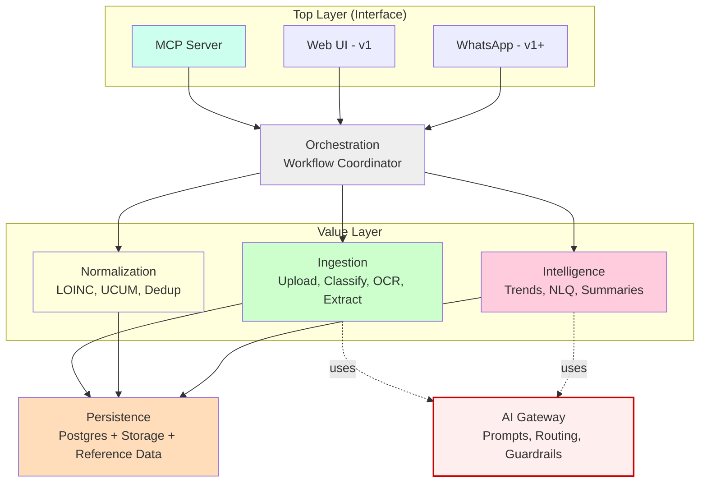
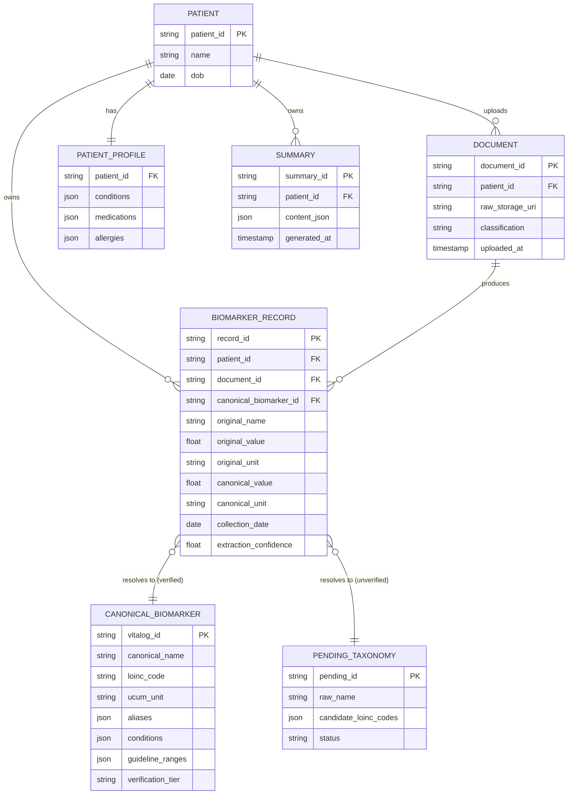
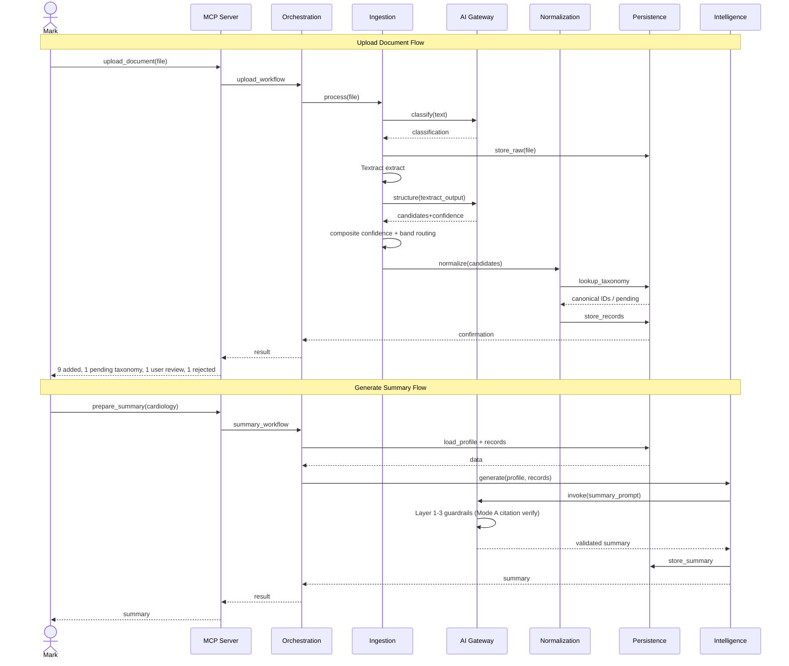
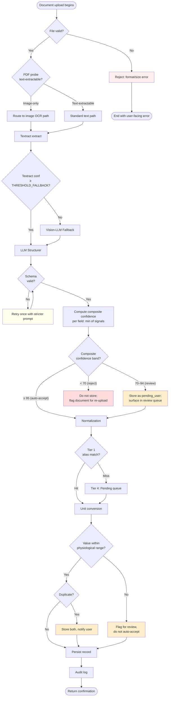

# Vitalog — System Architecture Document

| Field | Value |
|---|---|
| **Version** | 1.0 (Final) |
| **Date** | May 2026 |
| **Author** | Solo Founder |
| **Status** | Living document — updated as decisions evolve |
| **Companion documents** | `vitalog_prd.md`, `vitalog_roadmap.md`, `decisions.md` |

---

## 1. Document Purpose & Audience

### Purpose

This document describes the system architecture of Vitalog — a patient-facing health intelligence tool for chronic-condition patients. It captures the design decisions, component boundaries, data flows, and technology choices that shape the system, with explicit reasoning for each major decision.

This is a **living document**. It will be updated as decisions evolve through capstone development and into v1.

### Audience

The document is written for three audiences:

- **Capstone reviewers** evaluating the rigor and soundness of the design. Sections 1–4 and 9–10 are most relevant.
- **Engineers building the system** (initially the founder, later collaborators or AI coding agents like Claude Code). Sections 5–8 are most relevant for implementation.
- **Future-self** revisiting decisions in week 2, in v1, or beyond. Section 10 (Decision Log) and Section 12 (Open Questions) are designed to preserve context that's easy to forget.

### What this document covers

- The system's logical architecture and component boundaries
- Data architecture, including persistence and reference data
- Cross-cutting concerns: AI gateway, guardrails, observability, security
- Critical workflows traced end-to-end through the system
- Technology choices with documented alternatives
- Capstone scope vs. deferred work, with explicit triggers for revisiting

### What this document does *not* cover

- Detailed class hierarchies, function signatures, or SQL queries (these belong in code)
- Product requirements (see `vitalog_prd.md`)
- Future roadmap and deferred scope (see `vitalog_roadmap.md`)
- UI/UX design (out of scope for capstone — MCP-only demo)

### Non-goals of the system

To set scope expectations cleanly, Vitalog explicitly does **not** aim to:

- Provide clinical decision support, diagnoses, or treatment recommendations
- Replace EHR systems or function as a system of record for providers
- Offer telemedicine or direct provider communication
- Pull data automatically from healthcare provider systems (capstone is upload-only)
- Operate as a HIPAA-covered entity (the user is the data controller; Vitalog is a tool)

---

## 2. System Overview

Vitalog ingests health documents (lab reports as PDFs or photos), extracts and normalizes biomarker data, builds longitudinal trends with condition-aware context, and generates appointment-ready summaries. The system is designed **MCP-first** (Model Context Protocol): the value layer is exposed through MCP tools that any compatible client can use, with the demo channel being Claude Desktop.

The architecture follows a **two-layer model with a four-concern value layer**:

- **Top Layer (Interface)** — pluggable channels (MCP for capstone; web, WhatsApp, etc., post-capstone)
- **Value Layer** — the durable core of the product, split into four logical concerns:
  - **Ingestion** — file intake, classification, OCR, structured extraction
  - **Normalization** — canonical naming (LOINC), unit conversion (UCUM), deduplication, provenance
  - **Persistence** — structured storage, raw document storage, reference data
  - **Intelligence** — trend analysis, natural language queries, observation generation, summary generation

A horizontal **AI Gateway** sits across the value layer, providing the single chokepoint for all LLM calls with versioned prompts, model routing, and layered guardrails.

### System Context

The system context can be summarized as: the patient (Mark), the documents he uploads, the external services Vitalog depends on (AWS Textract, Anthropic API), the clients that consume Vitalog (Claude Desktop via MCP), and the reference data it uses (LOINC, UCUM, clinical guidelines). The four-concerns diagram in Section 4 captures this structure visually.

---

## 3. Architectural Principles

These are the non-negotiable design rules that shape every decision in the system. They are listed in priority order — when principles conflict, earlier ones win.

### P1 — Patient safety over feature velocity

Every architectural decision prioritizes preventing harm to the user. This means: hard constraints on clinical advice generation, layered guardrails on all LLM outputs, citation verification on all generated content, and conservative defaults when the system is uncertain.

### P2 — Channel-agnostic value layer

The value layer must be usable by any interface — MCP today, web tomorrow, WhatsApp later. No channel-specific logic leaks into the value layer. All channels consume the same orchestration API.

### P3 — Single chokepoint for all LLM calls

No service in the system calls an LLM provider directly. Every LLM interaction routes through the AI Gateway, which owns prompt versioning, model selection, and guardrails. This is the single most important architectural rule for a health AI product.

### P4 — Determinism wherever possible

LLMs are used for tasks that genuinely require them (extraction, generation). Tasks that can be deterministic (unit conversion, taxonomy lookup, date parsing, math) must be deterministic. Mixing deterministic and probabilistic logic in the same code path is forbidden.

### P5 — Provenance for every data point

Every biomarker record stored in the system carries full provenance: source document ID, extraction confidence, verification status, original lab name, original units, canonical name, canonical units, and audit timestamps. Without provenance, no claim about the data can be defended.

### P6 — Eval-driven development

No prompt change ships without running the regression eval suite. Accuracy and constraint-compliance are measured, not estimated. The eval suite is part of the value layer, not an afterthought.

### P7 — Designed for migration

Persistence and external service dependencies are wrapped in abstractions (repository pattern, gateway pattern). Migration from Supabase to AWS, from Textract to another OCR provider, or from Claude to another LLM should be a one-adapter-file change, not a refactor.

### P8 — Honest about scope

What is built for capstone is documented. What is deferred is documented with reasons and triggers. The system makes no claims it cannot defend with code or measurements.

---

## 4. High-Level Architecture

### The two-layer model

```
┌──────────────────────────────────────────────────────────────┐
│                    TOP LAYER (Interface)                     │
│   MCP Server  │  Web UI (v1)  │  WhatsApp (v1+)  │  CLI     │
└──────────────────────────────────────────────────────────────┘
                              │
                              ▼
┌──────────────────────────────────────────────────────────────┐
│                       ORCHESTRATION                          │
│      (Workflow coordinator — thin, no business logic)        │
└──────────────────────────────────────────────────────────────┘
                              │
       ┌──────────────────────┼──────────────────────┐
       ▼                      ▼                      ▼
┌──────────────┐    ┌──────────────────┐    ┌──────────────┐
│  INGESTION   │    │  NORMALIZATION   │    │ INTELLIGENCE │
│              │    │                  │    │              │
│ Upload       │    │ LOINC mapping    │    │ Trends       │
│ Classify     │    │ UCUM convert     │    │ NLQ          │
│ OCR          │    │ Dedup            │    │ Observations │
│ Extract      │    │ Provenance       │    │ Summaries    │
└──────┬───────┘    └────────┬─────────┘    └──────┬───────┘
       │                     │                     │
       └─────────────────────┼─────────────────────┘
                             ▼
                  ┌──────────────────────┐
                  │     PERSISTENCE      │
                  │                      │
                  │ Postgres (Supabase)  │
                  │ Object Storage       │
                  │ Reference Data       │
                  │ Audit Log            │
                  └──────────────────────┘

      ┌──────────────────────────────────────────────────┐
      │              AI GATEWAY (cross-cutting)          │
      │                                                  │
      │  Prompt Registry │ Model Routing │ Guardrails    │
      │  (used by Ingestion + Intelligence)              │
      └──────────────────────────────────────────────────┘
```

### Diagram 2 — Four-Concerns Architecture

### Why four concerns

The four-concerns split is a **logical** boundary, not a microservices boundary. All four run in the same Python process for capstone (and likely v1). The split exists because each concern has fundamentally different properties:

| Concern | Reliability | Testing | Deployment cadence | LLM in hot path? |
|---|---|---|---|---|
| **Ingestion** | High retry tolerance | Eval against ground truth | Changes when OCR or extraction prompts evolve | Yes (structurer + fallback) |
| **Normalization** | Must be 100% reliable | Unit tests, deterministic | Stable once curated | **No** |
| **Persistence** | Must be 100% reliable | Integration tests | Stable | No |
| **Intelligence** | Probabilistic, guarded | Eval suites + LLM-as-judge | Changes weekly with prompt iteration | Yes (heavily) |

Mixing these would mean every prompt tweak in Intelligence risks the parser, every schema change in Normalization risks the trend engine, and so on. Keeping them separate protects each concern's reliability profile.

### Architecture diagram



---

## 5. Component Deep-Dive

This section describes each major component: what it does, what it depends on, and the key contracts it exposes.

### 5.1 Ingestion Service

**Responsibility:** Convert an uploaded document into a list of structured biomarker candidates with field-level confidence scores. Has no opinion about canonical names, units, or duplicates — that is Normalization's job.

**Inputs:**
- File bytes + filename + MIME type
- Patient ID (for provenance)

**Outputs:**
- Document record (stored): document_id, raw file pointer, classification, ingestion timestamp
- List of biomarker candidate records, each with:
  - Raw test name (as it appeared in the document)
  - Raw value, raw unit, raw reference range
  - Collection date (or null if not extractable)
  - Lab/source identifier
  - Field-level confidence scores (0–100)
  - Source-region pointers (page number, bounding box) for verification

**Internal pipeline:**

```
File arrives
    │
    ▼
1. Validation (MIME, size, format)
    │
    ▼
2. Pre-LLM probes (cheap, deterministic)
    │   - Empty / corrupt file → fast reject
    │   - File under minimum readable resolution → fast reject
    │   - PDF: text-extractable vs. image-only
    │
    ▼
3. Classification (LLM call via AI Gateway)
    │   - Returns: ClassificationResult(category, subtype, confidence, reasoning)
    │   - Capstone routes only on category; subtype captured for messaging + audit
    │   - Conservative bias: low confidence → not_supported
    │
    ▼
4. Routing dispatch (data-driven)
    │   - lab_report → continue pipeline
    │   - recognized_unsupported → store raw + return rejection notice
    │   - not_supported → discard raw + return rejection notice
    │
    ▼
5. Raw text/table extraction (AWS Textract)
    │
    ▼
6. Confidence check on Textract output
    │   ├─ Textract field confidence ≥ THRESHOLD_FALLBACK → continue
    │   └─ Below threshold → vision-LLM fallback path
    │       (THRESHOLD_FALLBACK is the auto-accept band lower bound,
    │        currently 95; calibrated week 2)
    │
    ▼
7. LLM Structurer (Claude Sonnet via AI Gateway)
    │   Input: Textract output (text + tables + KV pairs)
    │   Output: structured biomarker candidate JSON
    │
    ▼
8. Per-field composite confidence scoring
    │   - Composite signal: min(textract_field_confidence,
    │                            llm_structurer_confidence,
    │                            classification_confidence)
    │   - min() chosen over weighted average so the weakest signal dominates
    │     (conservative bias appropriate for health data)
    │   - Three-band model applied (see §5.1.1):
    │     • ≥ 95 (auto-accept band) → record proceeds to Normalization as verified
    │     • 70–94 (review band)     → record proceeds as verified_by='pending_user';
    │                                  surfaces in user review queue
    │     • < 70 (reject band)      → record not stored; document flagged for
    │                                  re-upload
    │
    ▼
9. Return candidate list to Orchestration
```

#### 5.1.1 Confidence band model

The Ingestion service applies a three-band model to every extracted field's composite confidence score. Boundary values (`THRESHOLD_AUTO_ACCEPT`, `THRESHOLD_REJECT`) are named constants, not magic numbers, and are calibrated against the ground-truth eval set in week 2 of capstone (see Appendix D).

| Band | Composite confidence | Action |
|---|---|---|
| Auto-accept | ≥ THRESHOLD_AUTO_ACCEPT (initial: 95) | Stored as verified; flows into trends |
| Review | THRESHOLD_REJECT ≤ c < THRESHOLD_AUTO_ACCEPT (initial: 70–94) | Stored as `verified_by='pending_user'`; surfaces in review queue; does not flow into trends until user-confirmed |
| Reject | < THRESHOLD_REJECT (initial: 70) | Not stored; document flagged for re-upload or re-extraction |

**Why three bands, not a threshold.** A binary auto-accept/reject forces every ambiguous extraction into one of two wrong outcomes. The review band gives the system an explicit "ask a human" zone, which is the correct response to ambiguity in a health context.

**Why min() composition.** A record's trustworthiness is bounded by its weakest signal. A confidently-extracted value from garbled OCR is no more trustworthy than the OCR allows; a perfectly-OCR'd value the LLM was uncertain about is no more trustworthy than the LLM allows. Averaging hides the weak link.

**Why per-signal thresholds are deferred to v1.** Independent thresholds for Textract, LLM, and classification confidence are more defensible in principle, but require per-signal calibration corpora the capstone eval set (~18 docs) cannot support. Documented as v1 deferred work in §11.

#### Document classification (capstone scope)

The classifier returns three top-level categories, but captures richer subtype information for v1 expansion:

| Category | What it covers | Pipeline action |
|---|---|---|
| `lab_report` | Standard structured lab panels (Quest, LabCorp, hospital labs, etc.) | Continue full pipeline |
| `recognized_unsupported` | Identifiable medical document but not a lab report — e.g., imaging report, discharge summary, visit note, pathology report, prescription, genetic test | Store raw doc; return rejection with subtype-specific message |
| `not_supported` | Not a medical document, or unclear medical relevance — e.g., personal photos, receipts, screenshots, non-medical PDFs, empty/blank scans, unreadable content | **Discard raw doc** (privacy); return rejection with generic message |

**Why three categories with rich subtype.** The classifier prompt is written for the full v1 taxonomy (imaging_report, discharge_summary, visit_note, pathology_report, prescription, genetic_test_report, etc.) and returns the specific subtype it detected. Capstone code only routes on the top-level category (collapsing all medical-but-unsupported subtypes into `recognized_unsupported`), but the subtype is preserved in audit logs and surfaced in user-facing messages ("This looks like a **discharge summary** — we currently only process lab reports"). When v1 expands the taxonomy, no prompt rework is required — only the routing table grows.

**User messages (capstone):**
- `lab_report` → "Processing your lab report..."
- `recognized_unsupported` → "This looks like a {subtype} — we currently only process lab reports. {Subtype} support is on our v1+ roadmap."
- `not_supported` → "This doesn't appear to be a medical document. Did you mean to upload a different file?"

**Conservative classification bias.** False positives (classifying random content as `lab_report`) are worse than false negatives (rejecting a valid lab report) — false positives propagate junk into the patient record, while false negatives are recoverable via user retry. The classifier prompt is engineered to default to `not_supported` when uncertain.

**Key design decisions:**
- Textract chosen over vision-LLM-direct for auditability (see Decision 02 in Section 10)
- LLM never sees the document image directly in the primary path — it only structures Textract's output. This eliminates a class of confabulation failures.
- Vision-LLM fallback exists as a designed-but-conditional second path for low-confidence Textract output (e.g., phone photos)
- Classification taxonomy is data-driven (enum + routing table) so v1 expansion to per-subtype categories is additive, not a refactor
- Storage decisions are governed by classification category (see Section 7.6)

**Dependencies:** AWS Textract, AI Gateway, Persistence (for raw doc storage)

**Capstone scope:** Full pipeline including vision-LLM fallback. Three-category classification (lab_report / recognized_unsupported / not_supported) with classifier prompt and contracts ready for v1 expansion to per-subtype categories.

---

### 5.2 Normalization Service

**Responsibility:** Map raw biomarker candidates onto canonical entities (LOINC-aware vitalog IDs), convert units to canonical UCUM units, detect duplicates, and attach full provenance. This is **deterministic code with no LLM in the hot path**.

**Inputs:**
- List of biomarker candidates from Ingestion
- Patient ID

**Outputs:**
- List of finalized biomarker records, ready for persistence
- Optional: list of pending taxonomy entries requiring review

**Internal pipeline (Tiered Resolution Model):**

```
Candidate biomarker arrives
    │
    ▼
Tier 1 — Exact alias match
    │   Look up raw name in alias index
    │   ├─ Hit → resolve canonical_id, proceed
    │   └─ Miss → Tier 4 (capstone)
    │
    ▼  (deferred to v1)
[Tier 2 — Fuzzy match: string similarity + embedding similarity]
    │
    ▼  (deferred to v1)
[Tier 3 — LOINC lookup: query local LOINC DB]
    │
    ▼
Tier 4 — Pending review queue
    │   Stage record with raw_name, candidate IDs, similarity scores
    │   Mark as unverified
    │
    ▼
Unit Conversion
    │   Convert raw value/unit to canonical UCUM unit using stored conversion rules
    │   Validate within plausible physiological range
    │
    ▼
Duplicate Detection
    │   Key: (canonical_id, exact_collection_date, value_within_tolerance)
    │   Both records stored if ambiguous; user/admin notified
    │
    ▼
Provenance Attachment
    │   Attach: document_id, extraction_confidence, verified_by,
    │           original_name, original_unit, canonical_name, canonical_unit
    │
    ▼
Return finalized records
```

**Capstone scope:** Tier 1 + Tier 4 only. Tiers 2 and 3 are designed-but-stubbed. ~30 biomarkers seeded with LOINC + UCUM + aliases manually curated.

**Why no LLM here:** Wrong unit conversion or wrong canonical mapping corrupts data forever. This concern must be 100% reliable, which means deterministic code with explicit lookup tables, not generative inference.

**Dependencies:** Persistence (taxonomy table, pending queue)

---

### 5.3 Persistence Service

**Responsibility:** Provide durable, queryable storage for all system data. Wraps Supabase (Postgres + Storage) behind repository abstractions so future migration to AWS-native is a one-adapter-file change.

**Storage components:**

| Component | Backend (capstone) | Backend (v2 candidate) | What it stores |
|---|---|---|---|
| Structured data | Supabase Postgres | AWS RDS Postgres | Patient profiles, biomarker records, summaries, audit log, taxonomy |
| Raw document storage | Supabase Storage | AWS S3 | Original uploaded PDFs/images, never deleted |
| Reference data | Local files in repo | Local files in repo | LOINC subset, UCUM, biomarker taxonomy seed, condition mappings, guideline ranges |
| Audit log | Supabase Postgres | AWS RDS Postgres | Every LLM call, every data write, every user action |

**Repository pattern (illustrative):**

The Persistence service exposes per-aggregate repositories. Services consume these interfaces, not Supabase SDK directly. Example interface shapes (not actual code):

- `BiomarkerRepository` — `add()`, `find_by_canonical_id()`, `list_for_patient()`
- `DocumentRepository` — `add()`, `get_by_id()`, `list_for_patient()`
- `TaxonomyRepository` — `find_by_alias()`, `list_pending()`, `add_pending()`, `confirm_pending()`
- `DocumentStore` (object storage) — `put()`, `get()`, `delete()`

**Capstone scope:** All repositories backed by Supabase. Reference data shipped as JSON in the repo, loaded into memory on startup. Audit log table simple but present.

**Dependencies:** Supabase Postgres + Supabase Storage. Reference data loaded from disk.

---

### 5.4 Intelligence Service

**Responsibility:** Generate trends, observations, natural language query responses, and appointment summaries from stored patient data. Every operation is gated by the AI Gateway and its guardrails.

**Sub-components:**

#### 5.4.1 Trend Engine
Builds longitudinal time-series for any biomarker. Pure code, no LLM.
- Fetches all records for a given canonical_id and patient_id
- Sorts by collection_date
- Resolves reference range overlay (preferred: condition-specific guideline range, e.g., ADA target for diabetics)
- Returns time-series structure + range bands + per-point provenance

#### 5.4.2 Observation Generator
Generates 1–3 sentence plain-language descriptions of a biomarker reading. LLM call.
- Hard constraints: factual only, no clinical inference, no recommendations, no cause attribution
- Citation requirement: any numeric value mentioned must be traceable to source records via Mode B parse-and-match verification (see §7.2.1)
- Output passes through Layer 3 guardrails (banned-phrase filter, schema validator, Mode B citation verifier)

#### 5.4.3 Natural Language Query Handler
Answers patient questions about their own data. LLM call.
- Hard constraint: answers ONLY from stored data, never general medical knowledge
- Retrieval-first: relevant records pulled deterministically before LLM is called
- Graceful fallback when data is missing ("We don't have any TSH results yet")
- Output passes through Layer 3 guardrails (Mode B citation verification per §7.2.1, banned-phrase filter, schema validator)

#### 5.4.4 Summary Generator
Generates structured one-page appointment summaries. LLM call.
- Inputs: patient profile + condition profile + specialist type + visit type + retrieved relevant records
- Structured output: conditions, medications, results, trends, data gaps, patient notes, questions
- Hard constraints: no diagnostic language, no treatment suggestions, every numeric value cited via structured citation tuple
- Citation enforcement: the prompt uses Claude tool use to require every emitted biomarker value to be wrapped in a citation object `{value, unit, collection_date, source_record_id}`. Verification (Mode A — see §7.2.1) is a deterministic database lookup against the retrieval set passed into the prompt. Any unverifiable citation causes atomic rejection of the generation.
- Derived values (e.g., "improved by 0.4% over six months") cite endpoint records, not the derivation itself. Endpoint verification is enforced; arithmetic is not independently verified (documented limitation, §12).
- Disclaimer always included
- Output passes through Layer 3 guardrails (Mode A citation verification, schema validator, banned-phrase regex) plus optional LLM-as-judge (stretch for capstone)

**Why retrieval-first:** A patient with 4+ years of quarterly panels can have 60+ biomarker records. Stuffing the full record into context wastes tokens and dilutes LLM attention. Each Intelligence sub-component retrieves only the records it needs (per specialist, per query, per biomarker).

**Dependencies:** AI Gateway (for all LLM calls), Persistence (for retrieval), Reference Data (for guideline ranges)

---

### 5.5 AI Gateway (cross-cutting capability)

**Responsibility:** Single chokepoint for every LLM interaction in the system. Owns prompt versioning, model selection, layered guardrails, and eval logging.

**Sub-components:**

- **Prompt Registry** — stores versioned prompts (`extract@v3`, `summary_cardiology@v1`). Prompts are first-class artifacts, not strings buried in code. Version locked when an eval-suite run passes.
- **Model Router** — selects model per task. Capstone: Claude Sonnet for structuring/generation, Claude with vision for OCR fallback. Architecture supports stub adapters for OpenAI, Gemini.
- **Guardrails** (see Section 7 for detail) — Layer 1 (input filters), Layer 2 (prompt-level constraints embedded in registry), Layer 3 (output validators).
- **Eval Logger** — every LLM call logged with prompt_id, version, inputs, outputs. Feeds the offline eval pipeline.

**Why single chokepoint:**
- Guardrails apply uniformly — no service can bypass them
- Prompt changes are auditable and reversible
- Provider migration is one-adapter swap
- Cost and latency are observable system-wide

---

### 5.6 Orchestration Layer

**Responsibility:** Coordinate workflows across services. Owns session state, request tracing, audit logging entry points. Has **no business logic** — it composes calls to services that do the actual work.

**Capstone workflows:**
- `upload_document_workflow` — Ingestion → Normalization → Persistence → return confirmation
- `view_trend_workflow` — Persistence (retrieve) → Intelligence (trend engine) → return chart-ready data
- `query_workflow` — Persistence (retrieve relevant) → Intelligence (NLQ) → return answer
- `generate_summary_workflow` — Persistence (retrieve relevant) → Intelligence (summary) → return summary

**Why thin:** Orchestration that grows business logic becomes a god-class. Services own their own logic; orchestration just composes them.

---

### 5.7 Top Layer — MCP Server (capstone)

**Responsibility:** Expose the system via Model Context Protocol so that any MCP-compatible client (Claude Desktop being the primary capstone target) can consume Vitalog.

**MCP tools exposed (capstone):**
- `upload_document(file)` — ingest a document, return record summary
- `list_biomarkers(patient_id, filter?)` — list available biomarkers for a patient
- `get_trend(patient_id, biomarker_id)` — fetch a longitudinal trend with target ranges
- `query_records(patient_id, question)` — natural language query over patient's data
- `prepare_summary(patient_id)` — generate appointment summary
- `export_summary(summary_id, format)` — return summary as PDF/markdown/JSON

**Dependencies:** Orchestration only. The MCP server is a thin protocol adapter — no business logic, no persistence calls, no LLM calls of its own.

---

## 6. Data Architecture

### 6.1 Core data model

The core entities and their relationships:

```
Patient (1) ──────< Document (many) ──────< BiomarkerRecord (many)
   │                                              │
   │                                              ▼
   │                                      CanonicalBiomarker
   │                                       (taxonomy entry)
   │
   └────< Summary (many)
   │
   └────< Profile (1)
            ├── conditions
            ├── medications
            └── allergies
```

### 6.2 Schema sketch (illustrative, not final)

```sql
-- Patient profile
patient (
  patient_id, name, dob, ...
)

patient_profile (
  patient_id,
  conditions     JSON,  -- ["T2D", "HTN", "Hypothyroid"]
  medications    JSON,  -- [{name, start_date, ...}]
  allergies      JSON
)

-- Documents
document (
  document_id, patient_id,
  raw_storage_uri,        -- S3/Supabase Storage pointer
  classification,         -- 'lab_report' | 'discharge' | 'unsupported'
  uploaded_at,
  processing_status
)

-- Biomarker records (the heart of the system)
biomarker_record (
  record_id, patient_id, document_id,
  canonical_biomarker_id,    -- nullable until verified
  pending_taxonomy_id,       -- nullable; links to pending queue if unverified

  -- Original (as extracted)
  original_name, original_value, original_unit, original_range,

  -- Canonical (post-normalization)
  canonical_value, canonical_unit,

  -- Provenance
  collection_date,
  lab_source,
  extraction_confidence,
  verified_by,               -- 'auto' | 'user' | 'admin' | 'pending_user'

  created_at
)

-- Canonical taxonomy (curated + lazy-grown)
canonical_biomarker (
  vitalog_id PRIMARY KEY,    -- "hba1c"
  canonical_name,
  loinc_code,                -- "4548-4"
  ucum_unit,                 -- "%"
  unit_conversions JSON,     -- {"mmol/mol": {factor: 0.0915, offset: 2.15}, ...}
  aliases JSON,              -- ["HbA1c", "Hemoglobin A1c", "A1C", ...]
  conditions JSON,           -- ["T2D", "T1D", "Prediabetes"]
  guideline_ranges JSON,     -- {"ADA_target": "<7.0", "ADA_normal": "<5.7", ...}
  guideline_citations JSON,
  verification_tier,         -- 'canonical' | 'user_confirmed' | 'auto_linked' | 'pending'
  verified BOOLEAN,
  created_at, updated_at
)

-- Pending review queue (Tier 4)
pending_taxonomy_entry (
  pending_id, raw_name, raw_unit, document_id,
  candidate_loinc_codes JSON,
  proposed_canonical_name,
  similarity_to_existing JSON,
  status,                    -- 'pending' | 'confirmed' | 'rejected' | 'merged'
  resolved_at, resolved_by
)

-- Summaries
summary (
  summary_id, patient_id,
  generated_at,
  content_json,              -- structured sections
  patient_annotations,
  exported_formats JSON
)

-- Audit log
audit_log (
  log_id, timestamp,
  actor,                     -- patient_id or 'system'
  event_type,                -- 'document_uploaded' | 'llm_call' | 'export' | ...
  payload JSON               -- redacted of PHI
)
```

### Diagram 3 — Data Model (Mermaid ER diagram)



### 6.3 Reference data

Reference data lives in the repo as version-controlled JSON, not in the database:
- `reference_data/loinc_subset.json` — ~30K lab observation codes from LOINC
- `reference_data/ucum_units.json` — common medical units and conversion rules
- `reference_data/biomarker_taxonomy_seed.json` — initial 30-entry curated taxonomy
- `reference_data/biomarker_groups.json` — condition-to-biomarker groupings with embedded guideline citations (F5)
- `reference_data/guideline_ranges.json` — ADA/AHA/ACC/ATA target ranges with citations

This is loaded at startup. Updates require a code change and PR review — appropriate for data this critical.

### 6.4 Provenance model

Every biomarker record stores both its **as-extracted** form (original name, value, unit, range) and its **canonical** form (vitalog_id, canonical value, canonical unit). This means:

- Trends are computed in canonical form (consistent units, consistent IDs)
- The original lab's framing is never lost
- A bug in normalization can be detected by comparing original vs. canonical
- A taxonomy update can re-run normalization on existing records without losing the source-of-truth original

### 6.5 Storage strategy for raw documents

- Originals never deleted — required for audit, for re-extraction after parser improvements, for user trust
- Stored in object storage (Supabase Storage now, S3 later), addressed by `document_id`
- Access controlled by patient_id — even with the URI, unauthorized access is rejected by Supabase RLS / S3 IAM
- For capstone: all storage on Supabase Free with synthetic + redacted data only

---

## 7. Cross-Cutting Concerns

### 7.1 AI Gateway in detail

The AI Gateway is the single most important architectural element for safety. Every LLM call passes through it.

**Logical flow of a gateway call:**

```
caller.invoke(prompt_id, inputs, output_schema)
    │
    ▼
┌──────────────────────────────────────────┐
│  Layer 1: Input filters                  │
│  - PII redaction for logs                │
│  - Prompt-injection pattern detection    │
└──────────────────────────────────────────┘
    │
    ▼
┌──────────────────────────────────────────┐
│  Layer 2: Prompt assembly (versioned)    │
│  - Safety preamble prepended             │
│  - Few-shot refusal examples included    │
│  - Schema enforcement (tool use)         │
└──────────────────────────────────────────┘
    │
    ▼
┌──────────────────────────────────────────┐
│  Model invocation                        │
│  (Claude Sonnet via Anthropic API)       │
└──────────────────────────────────────────┘
    │
    ▼
┌──────────────────────────────────────────┐
│  Layer 3: Output validators              │
│  - JSON schema (Pydantic)                │
│  - Banned-phrase regex filter            │
│  - Citation verification                 │
│  - LLM-as-judge (stretch)                │
└──────────────────────────────────────────┘
    │
    ▼
Eval logging → return validated output
```

**On any layer failure:**
- Layer 1 fail → reject request, log security event
- Layer 2 (model error) → retry with backoff, then fail soft
- Layer 3 fail → retry with tighter prompt, then strip offending content, then fail soft (refuse to generate rather than ship unsafe output)

### 7.2 Layered guardrails — full specification

| Layer | Mechanism | Catches | Capstone scope |
|---|---|---|---|
| **Layer 1 — Input** | PII redaction, injection detection | PHI in logs; document-injected instructions | ✅ MVP |
| **Layer 2 — Prompt** | Safety preamble, few-shot refusals, schema enforcement | Most clinical-advice attempts; unstructured outputs | ✅ Full |
| **Layer 3 — Output (regex)** | Banned-phrase filter | Explicit advice language ("you should", "I recommend", etc.) | ✅ Full |
| **Layer 3 — Output (schema)** | Pydantic validation | Malformed JSON, missing required fields | ✅ Full |
| **Layer 3 — Output (citation)** | Verify every value in output traces to a stored record (Modes A and B — see §7.2.1) | Hallucinated biomarker values | ✅ Full |
| **Layer 3 — LLM-as-judge** | Second LLM scores output for advice/inference/prediction | Subtle clinical inference that regex misses | 🔄 Stretch |
| **Layer 4 — Regression eval** | Adversarial prompt set + factuality eval, run before any prompt change | Prompt-change regressions | ✅ Full |

### 7.2.1 Citation verification specification

Citation verification is the load-bearing safety guarantee against hallucinated biomarker values in generated content. Two verification modes are used, selected by the output type of the calling component.

#### Mode A — Structured citation (Summary Generator)

Used where output is structured by design. The Summary Generator's prompt enforces a tool-use schema requiring every numeric biomarker value to be wrapped in a citation object containing `value`, `unit`, `collection_date`, and `source_record_id`. Verification proceeds as follows:

1. **Lookup** the record by `source_record_id` via `BiomarkerRepository`
2. **Ownership check** — record's `patient_id` matches the generation context
3. **Retrieval-set check** — `source_record_id` must be in the set of record IDs passed into the prompt (prevents LLM from citing records outside its permitted scope)
4. **Field match** — `canonical_value` within ±0.5% rounding tolerance, `canonical_unit` exact match, `collection_date` exact match

Any failure causes atomic rejection of the entire generation.

For derived statements (e.g., "HbA1c improved by 0.4% over six months"), the schema requires citing the endpoint records. The arithmetic itself is not independently verified — this is a documented limitation (see §12).

#### Mode B — Parse-and-match (Observation Generator, NLQ Handler)

Used where prose output is required. The verifier extracts numeric tokens from the LLM output (with adjacent unit context where present) and matches each against the retrieval set:

- **Match rule** — `canonical_value` OR `original_value` within ±0.5% tolerance for decimals, exact match for integers
- **Unit consistency** — if a unit appears adjacent to the numeric, it must match the matched record's canonical or original unit
- **Coverage** — every extracted numeric must have at least one match; unmatched numerics cause rejection

Mode B does not verify dates, qualitative claims (e.g., "trending up"), or detect cross-biomarker numeric collisions. These gaps are mitigated by Layer 3 banned-phrase regex and (when enabled) LLM-as-judge. See §12 for full limitations.

#### Failure handling

| Failure | Action |
|---|---|
| First-attempt verification fails | Retry once with stricter prompt |
| Retry fails | Reject generation; return safe refusal to caller; log at error level |
| Ownership / retrieval-set check fails | Reject; log as security event |
| Schema parse fails (Mode A) | Treat as verification failure |

The system never returns partially-verified output. Generation either passes all checks or is refused entirely.

#### Why two modes

A single mode would force a tradeoff: structured-only produces robotic NLQ responses; parse-only weakens verification on summaries. Two fit-for-purpose modes preserve natural language where it matters and preserve strong verification where the output structure permits it. The tradeoff is documented and the safety net is layered (verifier + banned-phrase regex + LLM-as-judge).

### 7.3 Observability

For capstone, observability is intentionally minimal but principled:

- **Audit log** — every LLM call, every document upload, every export, written to Postgres
- **Eval log** — separate stream feeding the offline eval pipeline
- **Application logs** — structured JSON, written to stdout for capstone (Supabase logs in v1)
- **Cost tracking** — per-model token counts logged, summed nightly
- **No external observability stack for capstone** (no Datadog, Sentry, etc.) — defer to v1

### 7.4 Security and PHI handling

- Capstone: no real un-redacted PHI on the system. Synthetic + redacted data only.
- All third-party API calls (Textract, Anthropic) use synthetic data during capstone.
- For v1: BAA with Supabase (Team plan + HIPAA add-on), BAA with Anthropic (enterprise plan), BAA with AWS (covers Textract).
- Application-level encryption for sensitive fields above and beyond Supabase's at-rest encryption — deferred design decision.
- Authentication: Supabase Auth in capstone (basic), MFA enforced for admins in v1.
- Row-level security (RLS) in Postgres: every query scoped to `patient_id = auth.uid()`.

### 7.5 Error handling philosophy

- **Fail loud at the boundaries, fail soft inside.** Schema validation errors at API entry must be rejected with clear messages. Internal errors should degrade gracefully — a trend chart that loads with 8/9 data points is better than no chart.
- **Never silently fail on safety checks.** Layer 3 violations are logged at error level, return a refusal to the caller, and never produce partial output.
- **Confidence is a first-class signal.** Low-confidence extractions go to user review, not to silent acceptance.

### 7.6 Storage policy for uploaded content

**Core rule: classification decides storage, not the other way around.**

Raw uploaded files are not stored unconditionally. Storage is a downstream consequence of classification — the system stores what it should keep and discards what it shouldn't accumulate.

**Storage rules (capstone):**

| Classification category | Raw file stored? | Audit metadata? | Rationale |
|---|---|---|---|
| `lab_report` | ✅ Yes, permanent | ✅ Yes | Medical record; required for re-extraction, audit, user trust |
| `recognized_unsupported` | ✅ Yes, permanent | ✅ Yes | User may want to revisit when v1+ adds support; medical content worth keeping |
| `not_supported` | ❌ **Discarded after classification** | ✅ Yes (filename, MIME, size, timestamp, classification result) | Privacy: accidental personal photos, receipts, screenshots, and other non-medical content should not accumulate on Vitalog's servers |

**Why this matters.** A user who accidentally uploads a personal photo (camera-roll mistake), an old receipt, or any other non-medical content has a reasonable expectation that the file is not retained. The PRD's "originals never deleted" rule was written for medical documents — extending it implicitly to *all* uploaded content would create a privacy concern. Classification-gated storage resolves this without compromising auditability for actual medical records.

**Audit metadata is always written.** Even when the raw file is discarded, the system retains a metadata record of the upload event: filename, MIME type, file size, timestamp, classification result, and confidence score. This preserves the audit trail without retaining the content.

**Implementation note.** The Persistence service exposes `store_raw(file, retention_policy)` rather than a single store method. The Ingestion service decides retention based on classification routing rules. Adding new categories or storage policies in v1 (e.g., consent-based storage for genetic test reports) is a routing-table change, not a Persistence service change.

**Out of scope for capstone:**
- Image content moderation for inappropriate uploads (deferred to v1)
- User-visible UI for viewing/managing stored documents (deferred to v1; capstone has no web UI)
- User-initiated deletion of stored documents (deferred to v1)

---

## 8. Key Workflows

This section traces the most important end-to-end flows through the system. These are the flows that the capstone demo will exercise.

### 8.1 Upload workflow (the hero flow)

**User action:** Mark uploads a Quest lab report PDF via MCP.

**Step-by-step:**

1. **MCP server** receives `upload_document(file)` call from Claude Desktop
2. **Orchestration** invokes `upload_document_workflow(file, patient_id)`
3. **Ingestion: validation** — MIME type, size, format checks
4. **Ingestion: PDF probe** — text-extractable PDF detected
5. **Ingestion: classification** — AI Gateway call, returns `lab_report` with confidence 0.97
6. **Persistence: store raw doc** — file saved to Supabase Storage, document record created
7. **Ingestion: Textract** — text + tables extracted, all confidences > 0.95
8. **Ingestion: structurer** — AI Gateway call to Claude Sonnet, returns 12 biomarker candidates with field-level confidence
9. **Ingestion: composite confidence + band routing** — composite confidence computed per field as min(textract, llm, classification); 10 fall in auto-accept band, 1 in review band, 1 in reject band
10. **Normalization: Tier 1 lookup** — 9 auto-accept candidates resolve to existing canonical IDs via alias match
11. **Normalization: Tier 4 routing** — 1 candidate has no match, queued in `pending_taxonomy_entry` with status=pending
12. **Normalization: unit conversion** — all resolved candidates converted to canonical UCUM units
13. **Normalization: dedup** — no duplicates against existing records for this patient
14. **Persistence: store records** — 9 verified biomarker records + 1 unverified (linked to pending IDs) + 1 pending_user (review band); 1 reject-band record not stored
15. **Audit log** — `document_uploaded` event recorded, with band-distribution metrics
16. **Orchestration** returns confirmation: "9 results added, 1 pending taxonomy review, 1 pending user review, 1 unreadable"
17. **MCP server** formats response for Claude Desktop

**Alternative branches (non-`lab_report` classifications):**

The happy path above assumes step 5 returns `lab_report`. If classification returns a different category, the workflow takes one of two short-circuit paths instead of continuing through Textract and structuring:

- **`recognized_unsupported`** (e.g., a discharge summary or imaging report):
  6a. Persistence: store raw doc (per Section 7.6 storage policy)
  7a. Audit log: `document_classified_unsupported` event with subtype recorded
  8a. Orchestration returns rejection notice with subtype-specific message
  9a. MCP server returns to Claude Desktop: e.g., "This looks like a discharge summary — we currently only process lab reports. Discharge summary support is on our v1+ roadmap."

- **`not_supported`** (random photo, non-medical content, unreadable file):
  6b. Raw doc **discarded** (per Section 7.6 storage policy)
  7b. Audit log: `document_classified_not_supported` event with metadata only (filename, MIME, size, classification result, confidence)
  8b. Orchestration returns rejection notice with generic message
  9b. MCP server returns to Claude Desktop: "This doesn't appear to be a medical document. Did you mean to upload a different file?"

In both alternative branches, the pipeline does not invoke Textract, the structurer, or Normalization. Cost and latency are bounded by the classification call alone.

### 8.2 Trend view workflow

**User action:** Mark asks Claude Desktop to show his HbA1c trend.

**Step-by-step:**

1. MCP server receives `get_trend(patient_id, "hba1c")`
2. Orchestration invokes `view_trend_workflow`
3. Persistence: `BiomarkerRepository.list_for_patient(patient_id, canonical_id="hba1c")` — returns 9 records across 3 labs
4. Intelligence: Trend Engine sorts records by collection_date, attaches target ranges (ADA target <7.0% for diabetics from Mark's profile)
5. No LLM call required — pure data retrieval and shaping
6. Orchestration returns chart-ready structure (points + range bands + per-point provenance)
7. MCP server returns trend data to Claude Desktop, which renders/describes it

### 8.3 Appointment summary workflow

**User action:** Mark asks for a cardiology summary for an upcoming first visit.

**Step-by-step:**

1. MCP server receives `prepare_summary(patient_id, "cardiology", "first_visit")`
2. Orchestration invokes `generate_summary_workflow`
3. Persistence: load patient profile (conditions: T2D, HTN; medications: metformin, lisinopril, recent statin)
4. Reference data lookup: cardiology + first_visit content template (which biomarkers, which sections)
5. Persistence: retrieve relevant biomarker records (lipid panel, BP readings, HbA1c, fasting glucose, eGFR)
6. Intelligence: Summary Generator
   - AI Gateway call with composed prompt: profile + template + retrieved records
   - Layer 1: input redacted (logs only)
   - Layer 2: safety preamble + cardiology-specific few-shot examples
   - Model: Claude Sonnet (forced to emit structured citations per Mode A spec)
   - Layer 3: schema validated, banned-phrase filter passed, Mode A citation verifier confirms every value-tuple resolves to a record in the retrieval set
7. Persistence: summary record stored with full input/output
8. Audit log: `summary_generated` event with prompt version
9. Orchestration returns structured summary
10. MCP server returns to Claude Desktop, which presents to Mark for review/annotation
11. Mark adds note about recent statin start; calls `export_summary(summary_id, "pdf")`
12. Persistence: annotation appended; PDF rendered with disclaimer; returned to user

### Diagram 4 — Main Happy-Path Flow

The following sequence diagram traces the upload and summary-generation workflows through the system.



### 8.4 Error-handling flow (Diagram 5 — Mermaid)



---

## 9. Technology Choices & Rationale

This section documents each major technology decision with alternatives considered. Brief here; full reasoning in Section 10 (Decision Log).

### Stack summary

| Layer | Choice | Alternatives considered | Why |
|---|---|---|---|
| **Language / runtime** | Python 3.11+ | TypeScript, Go | Best LLM SDKs, best ML/data ecosystem, single-language repo simplifies solo dev |
| **OCR** | AWS Textract | Vision-LLM direct, Tesseract, Google Document AI, Azure | Auditable, mature, free tier covers capstone, strong on tables |
| **OCR fallback** | Claude with vision | GPT-4o, Gemini 2.5 Pro | Single-provider for capstone; provider swap deferred to v1 |
| **LLM structurer / generation** | Claude Sonnet (latest) | GPT-5, Gemini 2.5 | Strong instruction-following on medical constraints; tool-use schema enforcement; aligned with provider for vision |
| **Database** | Supabase Postgres | Self-hosted Postgres, AWS RDS, SQLite | Hosted, BAA-eligible v1 path, RLS built-in, fast setup |
| **Object storage** | Supabase Storage | AWS S3, local files | Same provider as DB for capstone; S3 in v2 |
| **Reference data** | Versioned JSON in repo | Database tables, external service | Critical, audit-friendly, no runtime dependency |
| **Schema validation** | Pydantic | dataclasses, marshmallow | Standard for LLM structured outputs; integrates with Claude tool use |
| **MCP server** | Anthropic Python SDK | TypeScript SDK | Aligned with rest of stack |
| **Eval harness** | Custom (Python) | Promptfoo, Braintrust, LangSmith | Lightweight; avoids tool lock-in; matches custom guardrails |

### Provider strategy

For capstone, **single-provider (Anthropic)** for all LLM calls:
- Reduces SDK/auth/billing complexity
- Prompt portability is overstated; cross-provider tuning would double the eval cost
- Eval suite stays simple

Architecture supports multi-provider via **stub adapters** in the AI Gateway. Real adapters wired in v1 if needed for cost optimization, redundancy, or task specialization (e.g., GPT-5 for handwriting-heavy fallback).

---

## 10. Architectural Decisions Log (ADRs)

Each ADR captures a major decision: context, options, decision, consequences, and revisit triggers.

### ADR-01 — Two-layer model with four-concern value layer

**Context:** Need to design a system that supports multiple interface channels (MCP, web, WhatsApp) while keeping the core intelligence stable.

**Options considered:**
- (A) Monolithic value layer — one big service
- (B) Two-layer split (Top / Value)
- (C) Two-layer with four-concern split inside Value
- (D) Microservices

**Decision:** Option C. Logical four-concern split inside a single Python codebase.

**Why:** Each concern has different reliability and testing properties. Mixing them couples unrelated changes. Microservices is over-engineering for solo dev at capstone scale.

**Consequences:** More upfront discipline on cross-folder imports. Architecture is portable to microservices later if needed.

**Revisit if:** Team grows beyond 3 engineers; deployment cadence diverges sharply between concerns; performance forces extraction of a concern as standalone service.

---

### ADR-02 — OCR strategy: Textract + LLM structurer (not vision-LLM direct)

**Context:** Need to extract structured biomarker data from lab report PDFs and images.

**Options considered:**
- (A) Vision-LLM direct (one call: image → JSON)
- (B) Traditional OCR + LLM structurer
- (C) Hybrid with vision-LLM fallback

**Decision:** Option C — Textract primary, vision-LLM (Claude vision) fallback for low-confidence Textract output.

**Why:** Vision-LLMs confabulate plausible numbers when source is ambiguous and that failure is hard to detect. Textract is auditable, mature, cheap, and strong on tables (which is what lab reports are). Fallback handles photo/handwritten edge cases.

**Consequences:** Two pipelines to maintain. Vision-LLM fallback adds complexity. But: confabulation failure mode largely eliminated in primary path.

**Revisit if:** Textract proves materially worse than vision-LLM on real reports; LlamaParse or similar AI-native parsers materially outperform; cost economics shift.

---

### ADR-03 — Hybrid LOINC-aware in-house taxonomy with lazy growth

**Context:** Need canonical naming and unit standardization for biomarkers across labs.

**Options considered:**
- (A) Pure in-house taxonomy (custom IDs, custom units)
- (B) Pure LOINC + UCUM adoption
- (C) Hybrid: in-house IDs with LOINC + UCUM codes attached, grown lazily

**Decision:** Option C with tiered resolution. Capstone: Tiers 1 + 4. v1: full tiers.

**Why:** Future-proofs for FHIR integration without forcing full LOINC adoption upfront. Lazy growth scales naturally with usage. Tiered resolution and human-in-the-loop confirmation prevent taxonomy poisoning.

**Consequences:** More upfront design than option A; less work than option B for capstone. Requires admin review queue for new entries.

**Revisit if:** LOINC integration becomes blocking for FHIR work; admin queue scales too slowly; user-facing review prompts become necessary earlier than v1.

---

### ADR-04 — Persistence: Supabase for capstone and v1, AWS for scale

**Context:** Need a database and object storage solution that supports HIPAA path for v1 without massive upfront work.

**Options considered:**
- (A) Local Postgres + filesystem (capstone-only, no v1 path)
- (B) Supabase Free → Team + HIPAA → AWS at scale
- (C) AWS native from day one (RDS + S3)

**Decision:** Option B.

**Why:** Velocity matters in early stages. Supabase Team + HIPAA is ~$950/mo and HIPAA-capable. AWS migration triggers documented (cost, control, customer demand). Repository pattern means migration is one-adapter-file change, not a refactor.

**Consequences:** ~$950/mo cost when v1 launches. Some Supabase-specific knowledge accumulated. Migration is real work but bounded.

**Revisit if:** Monthly bill exceeds $2,500; Supabase doesn't expose a needed control; enterprise customer demands AWS-native; deep AWS HIPAA service integration becomes valuable.

---

### ADR-05 — AI Gateway as single chokepoint for all LLM calls

**Context:** Need consistent guardrails, prompt versioning, and observability across all LLM interactions.

**Options considered:**
- (A) Direct LLM SDK calls from each service
- (B) Shared utility module
- (C) Full gateway pattern with layered guardrails

**Decision:** Option C.

**Why:** Single chokepoint makes guardrails uniform, prompt changes auditable, provider migration trivial, and cost observable. Health AI products fail loudly when guardrails are inconsistent.

**Consequences:** Slight upfront overhead. Every LLM call passes through one more abstraction layer.

**Revisit if:** Latency budgets get tight enough that the gateway becomes a bottleneck (unlikely at capstone scale).

---

### ADR-06 — Layered guardrails (4 layers)

**Context:** Need to prevent generation of clinical advice, hallucinated values, and unsafe outputs in a health AI product.

**Options considered:**
- (A) Prompt-level constraints only
- (B) Prompt + output regex
- (C) Full layered: input + prompt + output (regex + schema + citation) + LLM-as-judge + eval suite

**Decision:** Option C, with LLM-as-judge as a stretch goal for capstone.

**Why:** Prompt-level constraints alone fail under drift, subtle inference, and adversarial framing. Each layer catches a different failure class. The cost of building all layers is small relative to the cost of a single advice-generation incident.

**Consequences:** ~1 day of additional capstone work. Stronger defense story for reviewers. Foundation for v1 production.

**Revisit if:** Latency or cost of layered checks becomes prohibitive at scale (extremely unlikely).

---

### ADR-07 — Synthetic data via templated synthesis

**Context:** Need a test corpus large enough to test extraction across vendors and quality levels, but cannot use un-redacted real patient data.

**Options considered:**
- (A) Real reports only (limited, won't scale)
- (B) Pure LLM-generated PDFs
- (C) Templated synthesis: LLM for content, templates for layout

**Decision:** Option C. Plus 3–5 redacted real reports as realism anchor.

**Why:** Pure LLM-generated PDFs are too clean; accuracy on them won't predict real-world performance. Templated synthesis produces realistic-looking PDFs and yields ground truth for free (the JSON used to render IS the ground truth).

**Consequences:** 4–6 hours of upfront template-building. Reusable for v1.

**Revisit if:** Templated approach proves insufficiently varied; real (BAA-covered) data becomes available.

---

### ADR-08 — MCP-only demo for capstone, web UI deferred

**Context:** 3-week capstone timeline can't fit both a robust value layer and a polished web UI.

**Options considered:**
- (A) Web UI demo
- (B) MCP-only demo
- (C) Both
- (D) CLI demo

**Decision:** Option B.

**Why:** Capstone evaluates the LLM-product depth, not frontend polish. MCP demo showcases the value layer's channel-agnostic design. Frontend work doesn't differentiate the product.

**Consequences:** Reviewers must understand MCP. Demo fallback is CLI if MCP integration has quirks.

**Revisit if:** Capstone audience requires a visual UI for evaluation; MCP integration proves blocking.

---

## 11. Capstone vs. Production Boundaries

This section makes explicit what's in scope for the 3-week capstone vs. what is deferred. See `vitalog_roadmap.md` for the full forward-looking phases.

### In capstone scope

✅ Ingestion: Textract + LLM structurer + vision-LLM fallback
✅ Confidence band model with week-2 calibration (per Appendix D)
✅ Normalization: Tier 1 + Tier 4, with seeded ~30-biomarker taxonomy
✅ Persistence: Supabase Free, repository pattern, audit log, raw doc storage
✅ Intelligence: Trend Engine, Observation Generator, NLQ Handler, Summary Generator (limited to 1–2 specialists)
✅ AI Gateway: Layers 1, 2, 3 (regex + schema + citation verifier Modes A and B)
✅ Eval suite: ground truth + extraction accuracy + adversarial prompts + factuality
✅ MCP server with the 6 tools listed in 5.7
✅ Synthetic data generator script
✅ Test corpus of ~18 documents

### Deferred to v1 (immediate post-capstone)

⏳ LOINC Tier 2 (fuzzy match) and Tier 3 (live LOINC lookup)
⏳ Confidence-based routing for taxonomy review
⏳ User-facing taxonomy review prompts
⏳ LLM-as-judge guardrail layer (highest-priority safety gap; primary mitigation for §12 limitations 11, 12, and 14; required before any v1 launch with real users)
⏳ Per-signal confidence calibration (independent thresholds for Textract, LLM, and classification confidence rather than min() composition; requires ~200+ document corpus to be meaningful)
⏳ Continuous re-calibration of band boundaries as corpus grows
⏳ Confidence-band telemetry (track distribution of records across bands over time to detect extraction drift)
⏳ Multi-provider LLM routing (real adapters wired)
⏳ Web UI
⏳ Follow-up delta summaries (changes since last visit)
⏳ Expanded specialist coverage
⏳ Full Safe Harbor PII redaction
⏳ Supabase Team + HIPAA add-on
⏳ BAA with Anthropic
⏳ Formal HIPAA risk assessment
⏳ Expanded classification taxonomy (per-subtype categories: imaging_report, discharge_summary, visit_note, pathology_report, prescription, genetic_test_report, etc.)
⏳ Per-category storage policies (e.g., consent-based storage for genetic data)
⏳ Image content moderation for inappropriate uploads
⏳ Subtype-specific user messaging and v1+ category processing pipelines
⏳ User-initiated deletion of stored documents

### Deferred to v2 / scale

⏳ FHIR integration (MyChart, Quest, LabCorp portals)
⏳ Auto-promote logic for canonical taxonomy entries
⏳ AWS migration from Supabase
⏳ Contextual health tips feature
⏳ Provider-facing features
⏳ Admin dashboard for taxonomy curation
⏳ External observability stack (Datadog, Sentry)

### Triggers for revisiting deferred items

- **AWS migration:** monthly bill > $2,500 on Supabase; need controls Supabase doesn't expose; enterprise customer demand
- **LOINC Tiers 2/3:** admin queue growth becomes unmanageable; FHIR integration begins
- **LLM-as-judge:** any clinical-advice incident in production; v1 launch with real users
- **Multi-provider routing:** Anthropic outage causes user-visible downtime; cost optimization at scale; handwriting performance gap becomes material

---

## 12. Open Questions & Known Limitations

Acknowledging what we don't know is a strength signal. These are the items where the design is uncertain or has known weaknesses.

### Open questions

1. **Reference range overlay strategy on charts.** Decision: prefer condition-specific guideline range (e.g., ADA target for diabetics). Open: how to handle patients with multiple relevant conditions where ranges differ?
2. **Confidence band boundary calibration.** The three-band model (§5.1.1) is a designed choice; the initial boundary values (95 / 70) are placeholders pending week-2 calibration against the eval set per the methodology in Appendix D. Final boundaries will be reported with precision/recall numbers in the capstone results.
3. **Specialist content selection rationale.** For each specialist, *which* biomarkers are clinically relevant? Currently planned to start with cardiology with citation to AHA/ACC guidelines. Defensibility for additional specialists is open.
4. **Date semantics under conflict.** When collection_date and report_date differ significantly, which wins for trend ordering? Default: collection_date. Open: how to surface this to user when present.
5. **Pending queue UX during capstone.** With Tiers 1 + 4 only, every novel biomarker hits admin queue. Demo flow: should admin queue be empty by demo time (manually pre-resolved), or should the demo include showing the queue?

### Known limitations

1. **Eval set is statistically thin.** ~18 documents won't capture the variance of real-world lab reports. Accuracy numbers should be reported with explicit acknowledgment of corpus size.
2. **Single-provider dependency.** Anthropic API outage = product down. Acceptable for capstone; mitigated in v1 with multi-provider routing.
3. **Manual PII redaction is not Safe Harbor.** Capstone-grade redaction (removing obvious identifiers) is not the same as the 18-identifier HIPAA Safe Harbor process. Real-user data requires v1 redaction pipeline.
4. **No real-time portal integrations.** Capstone is upload-only. Mark must export from each portal manually. FHIR integration is a v2 milestone.
5. **Confabulation risk in vision-LLM fallback.** Fallback path inherits the confabulation risk that motivated choosing Textract primary. Mitigation: bounding-box / source-quote requirement on fallback output, plus higher confidence threshold for vision-LLM acceptance.
6. **Taxonomy seed of 30 biomarkers is small.** Many edge-case biomarkers will trigger pending queue. Acceptable for capstone (small corpus); v1 needs broader seed (~100 biomarkers). The `canonical_biomarker` table already exists in the Supabase schema with all required columns — the migration path is defined (see §12 limitation 18 below and `vitalog_roadmap.md` §9 "Taxonomy DB Migration").
7. **Admin queue scaling is bounded by founder time.** Capstone-only model. v1 confidence-based routing + auto-promote is required to bound admin work.
8. **Classification routing is collapsed to three categories for capstone.** Classifier captures rich subtype data and the prompt is written for the full v1 taxonomy, but only `lab_report` / `recognized_unsupported` / `not_supported` are acted on today. Expansion is data-driven (additional routing-table entries), not a re-architecture, but the absence of per-subtype processing pipelines means medical documents other than lab reports are uniformly rejected with a generic medical-but-unsupported message.
9. **No image content moderation.** The system relies on user good faith for non-malicious uploads. Inappropriate or adversarial image content would be classified as `not_supported` and discarded (per Section 7.6), but no explicit moderation API is invoked. Deferred to v1.
10. **Classification accuracy on borderline content is unmeasured for capstone.** Documents that are medical-adjacent but ambiguous (wellness app screenshots, supplement labels, fitness tracker exports, document scans of mixed lab and visit-note content) have not been included in the eval corpus. Real-world classification performance on these edge cases is untested.
11. **Citation verifier Mode A does not validate arithmetic on derived values.** When the Summary Generator emits a derived statement (e.g., "HbA1c improved by 0.4% over six months"), Mode A verifies the endpoint records cited but does not independently verify the arithmetic of the derivation. A miscalculated delta would pass verification if both endpoints are real. Partial mitigation in capstone: the prompt restricts derived statements to a small whitelist of forms (delta, percent change, comparison-to-target), which bounds the surface area but does not eliminate the gap. Full arithmetic verification is deferred to v1.
12. **Citation verifier Mode B does not catch hallucinated qualitative claims or cross-biomarker numeric collisions.** Mode B (used by Observation Generator and NLQ Handler) verifies extracted numerics against the retrieval set but cannot evaluate prose claims like "your cholesterol is trending up" or detect when a hallucinated value happens to collide with a real value from a different biomarker (e.g., "your TSH was 7.2" matching a real HbA1c of 7.2%). Capstone mitigations are partial: unit-consistency check reduces (but does not eliminate) collision risk; Layer 3 banned-phrase regex catches obvious qualitative claims using a fixed pattern set. The qualitative-claim gap is **not fully mitigated for capstone**. LLM-as-judge — the defense that would close this gap — is listed as a stretch goal in §7.2 and is not committed for capstone scope. See limitation 14 below.
13. **Mode B does not verify dates.** Numeric extraction in Mode B does not extract or verify dates appearing in prose output. A hallucinated date paired with a verified value would pass Mode B. Date verification is deferred to v1.
14. **LLM-as-judge is not implemented in capstone scope.** The §7.2 guardrails table lists LLM-as-judge as a stretch-goal Layer 3 defense. It is the intended mitigation for the qualitative-claim and arithmetic-derivation gaps in limitations 11 and 12. **For capstone, this defense is not built.** The acknowledged consequence is that the system can emit prose claims ("trending up", "concerning pattern", "improving") that pass all built guardrails (citation verifier Modes A and B, schema validator, banned-phrase regex) but constitute clinical inference the system is not architecturally designed to make. The prompt-level constraints in Layer 2 (safety preamble, few-shot refusal examples) are the primary defense against this class of failure in capstone, and Layer 2 is known to be insufficient under prompt drift and adversarial framing.

    This is the most significant unmitigated risk in the capstone safety posture, and is the highest-priority deferred item for v1. It is named explicitly here rather than absorbed into a "stretch goal" framing because a reader of §7.2 alone could mistakenly conclude that LLM-as-judge is partially built or merely awaiting tuning. Neither is the case for capstone.
15. **Calibration corpus is statistically thin.** The eval set of ~18 documents produces *initial* band boundaries, not optimized ones. Boundaries chosen on this corpus may shift materially when the corpus reaches v1 scale (~200+ documents). Mitigation: report calibration with explicit corpus size and confidence intervals; review boundaries as corpus grows.
16. **Composite confidence uses min() not per-signal calibration.** The system combines Textract, LLM, and classification confidence via `min()` rather than treating each signal independently. This is a defensible interim given calibration data limits but obscures signal-specific failure modes (e.g., "the LLM was uncertain on this field but Textract was fine"). Per-signal thresholds deferred to v1 (§11).
17. **LLM self-reported confidence is known to be poorly calibrated.** The `llm_structurer_confidence` signal is generated by Claude Sonnet itself and inherits known overconfidence biases of generative models. The min() composition partially mitigates this (Textract or classification confidence often dominates), but a confidently-wrong LLM extraction with high Textract confidence will still land in auto-accept. Citation verification (§7.2.1) is the downstream defense for the values that matter most (those used in summaries).

18. **Taxonomy is read from JSON files at runtime, not from the DB.** The `canonical_biomarker` table is fully designed and seeded in the Supabase schema but is not queried at runtime during capstone. `load_taxonomy()`, `Tier1.lookup()`, and `get_context_card()` all read from JSON files in `src/reference_data/` via `@lru_cache` loaders. This is intentional for capstone (no live-DB dependency during testing), but **must be flipped for v1** to support dynamic updates, admin curation, and the auto-promote pipeline. The migration is 3 steps — seed script, loader flip, env-flag JSON fallback for dev/test — and requires no schema changes (table is already correct). Context cards are computed on-demand through `load_taxonomy()`; they are not a separate DB entity at any scale, so the loader flip transparently benefits F4 with no card-level code changes.

### What would strengthen this document

- Performance benchmarks once measured (placeholder for week 3 results)
- Real cost data once measured (LLM tokens, Textract pages, Supabase usage)
- Screenshots of MCP integration in action (to be captured during demo prep)
- Updated schemas after week-1 implementation reveals adjustments

---

## Appendix A — Glossary

- **BAA** — Business Associate Agreement (HIPAA)
- **Canonical biomarker** — A standardized entry in our taxonomy with a stable vitalog_id, LOINC code, and UCUM unit
- **Confabulation** — When an LLM generates plausible-sounding but fabricated content (in this context: invented biomarker values)
- **FHIR** — Fast Healthcare Interoperability Resources, a healthcare data exchange standard
- **Ground truth** — Hand-verified correct answer for a test document, used for measuring extraction accuracy
- **LOINC** — Logical Observation Identifiers Names and Codes, the universal coding system for lab observations
- **MCP** — Model Context Protocol, Anthropic's open standard for connecting AI assistants to tools and data
- **PHI** — Protected Health Information (HIPAA term)
- **Provenance** — The complete record of where a piece of data came from, how it was processed, and who/what verified it
- **RLS** — Row-Level Security (Postgres feature)
- **Safe Harbor** — A specific HIPAA de-identification method requiring removal of 18 categories of identifiers
- **UCUM** — Unified Code for Units of Measure, the standard for medical units
- **vitalog_id** — Our internal canonical biomarker identifier (e.g., "hba1c")

---

## Appendix B — Diagram Index

| # | Diagram | Section | Purpose |
|---|---|---|---|
| 1 | Four-Concerns Architecture | §4 | Logical structure of the system |
| 2 | Data Model (ER) | §6 | Core entities and relationships |
| 3 | Main Happy-Path Flow (sequence) | §8 | Critical workflows traced through the system |
| 4 | Error-Handling Flow | §8 | Failure modes and recovery |

All diagrams are inline Mermaid blocks within this document. They render in any modern markdown viewer (GitHub, Claude.ai, VS Code, Obsidian, Notion).

---

## Appendix C — How to update this document

This is a living document. Updates should follow these rules:

1. **Bump the version** in the header table on any non-trivial change
2. **Update the date** in the header table
3. **Add an entry to `decisions.md`** for any architectural decision change
4. **If a diagram changes**, update the Mermaid block directly in the document
5. **If scope shifts** (item moves between capstone / v1 / v2), update Section 11 AND `vitalog_roadmap.md`
6. **If a known limitation changes** (mitigated, or revealed), update Section 12

Major version bumps (1.0 → 2.0) are reserved for fundamental architectural changes (e.g., switching from MCP-first to web-first, or changing the four-concerns split). Minor bumps (1.0 → 1.1) are for additions and refinements.

---

## Appendix D — Confidence Calibration Methodology

This appendix specifies how the confidence band boundaries (§5.1.1) are calibrated against the eval set during week 2 of capstone development.

### Methodology

1. **Corpus**: ~18 documents in the eval set, each with hand-verified extractions (the ground-truth set used for extraction accuracy measurement).

2. **Extraction run**: every document is processed end-to-end through the Ingestion pipeline. For each extracted field, the system records:
   - Textract field confidence
   - LLM structurer self-reported confidence
   - Document classification confidence
   - Composite confidence (computed as min of above)
   - Ground-truth match status (correct / incorrect / partial)

3. **Boundary search**: precision and recall are computed at each candidate boundary value:
   - `THRESHOLD_AUTO_ACCEPT` candidates: 90, 92, 95, 97, 99
   - `THRESHOLD_REJECT` candidates: 60, 65, 70, 75, 80

4. **Boundary selection criteria**:
   - **Auto-accept band**: precision ≥ 98% against ground truth (i.e., of all records auto-accepted, ≥ 98% are extraction-correct)
   - **Reject band**: ≤ 2% of ground-truth-correct extractions fall into this band (i.e., we're not discarding much good data)
   - **Review band**: absorbs the remaining ambiguous middle; size is a reported metric, not an optimized one

5. **Reporting**: chosen boundaries are reported in §11 capstone results with the precision/recall numbers that justified them, plus the size of each band as a percentage of total fields extracted.

### Honest scope

The 18-document corpus produces *initial* boundaries, not optimized ones. The boundaries are expected to shift as the corpus grows in v1 (target: 200+ documents). The methodology specified here is intentionally simple — more sophisticated approaches (e.g., per-biomarker calibration, per-document-type calibration, Platt scaling on raw signals) are deferred to v1 when the data supports them.

### Failure modes the methodology does not catch

- **Out-of-distribution documents**: if real-world documents differ systematically from the eval corpus (e.g., a lab vendor not represented), calibration on the eval set under-predicts real-world band assignments.
- **Drift over time**: extraction accuracy may shift as Textract, Claude, or prompts evolve. Re-calibration is required after any prompt or model change per Principle P6.
- **Per-biomarker variance**: HbA1c may calibrate differently from cholesterol. Single global boundaries hide this. Per-biomarker calibration deferred to v1.

---

*End of document.*
